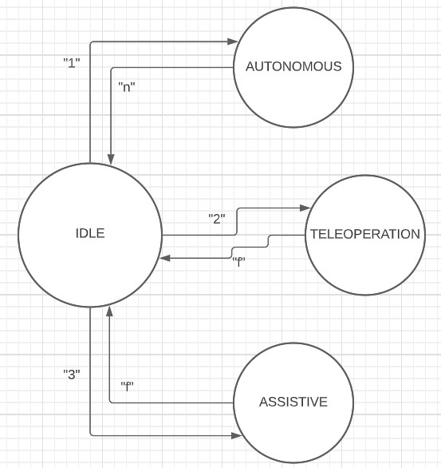
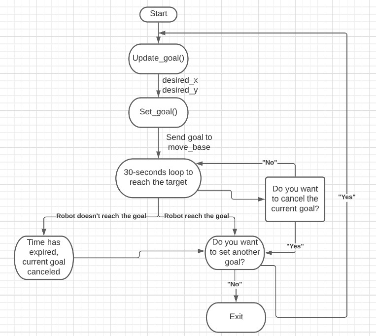
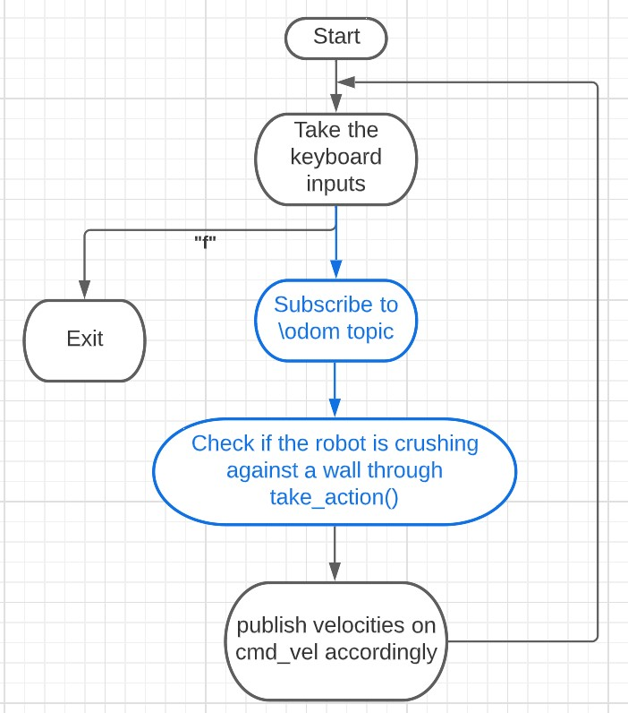

# Research Track 1 - Final Assignment 2021/2022

This a ROS package built in order to move a mobile robot inside a 2D circuit, in a simulator provided by professor [Carmine Recchiutto](http://github.com/CarmineD8).
In the assignment it was required to:
* create a UI to choose between different driving modalities: autonomous driving, teleoperation through keyboard and assistive teleoperation;
* In the first modality, the user has to set the coordinates of the goal, that the robot will reach autonomously. The user will also be able to cancel the goal while the robot is driving. All of that was done through the use of ros actions;
* The second and the third modalities are similar and the user can drive the robot on his own through the keyboard. In the third one, the robot will avoid the walls on his own, while in the second one it is not guaranteed that it won't crush.

## Running

It's possible to download the workspace and the slam package from the repository provided by the professor (http://github.com/CarmineD8/final_assignment) and (http://github.com/CarmineD8/slam_gmapping) and it is needed a catkin_make command to create all the CMakeLists.txt and package.xml files. In the workspace it is possibile to find two folders in particular: `scripts` where there are all the python scripts and `launch` where there are all the launch files need to start the simulation. To run the code we have to:
* Open 4 different tabs on the terminal;
* In the first tab we have to type `roslaunch final_assignment simulation.launch` to start Rviz and Gazebo; 
* In the second tab we have to type `rosrun final_assignment UserInterface.py` to launch the UI node;
* In the third one we have to type `rosrun final_assignment autonomous.py` after we have launched the UI and chose the first modality; 
* In the fourth one we have to type `rosrun final_assignment teleop_twist.py`, this time at any moment we want, it doesn't matter;

After having launched all the nodes, the node graph will look like this:

.

## User Interface

I decided to create the user interface through a FSM thanks to the smach library of ROS. The concept is to start the in the idle modality and then, based on the user inputs, move through the states that corresponds to the driving modalities.
Here I report a simple scheme of the state machine, with the input to change the state: 

## Autonomous and Teleoperation nodes

I decided to let the user open various tabs in the terminal because it is more clear what we are doing. This way, also the instructions on how to enter/exit a modality and what to do inside of it, don't overlap.
Here I report the flow chart of the code of the Autonomous modality:

and the flow chart of the code of the Teleoperation modality:

I would like the reader to notiche that the blue part of the scheme is running only if we are in the assistive modality.

## Launch files

There are 3 launch files that we need to run the simulation: `move_base.launch` `simulation_gmapping.launch` `simulation.launch` `assignment.launch`. The first two concerns the simulation in Gazebo and Rviz (the two different simulation environments); the third finds all the other launch files in the correct folder and set a parameter to start in the correct modality in the state machine.  

## Conclusions

Overall, I think that the robot is driving, in all the modalities, in an efficient way and that the flaw of the instructions is pretty linear and easy to understand. I've also included all the optional aspects requested.
There are surely some aspects that can be improved:
* First of all, in my code, I expect someone to be able to open and manage different tabs on the terminal (this requires a base knowledge that not everyone has). It would be nice to reduce the tabs to only two (one is impossible because the simulation of Gazebo and Rviz print an insane amount of messages);
* In the assistive modality, I've set a key sleep of 0.5 seconds so that the user can't give too many inputs but this can be very annoying because the robot doesn't move in a smooth way; 
* In the autonomous modality, I don't like how the user can cancel the goal because there could be cases where he is not effectively able to choose but it was the most functioning way to do so I could find.